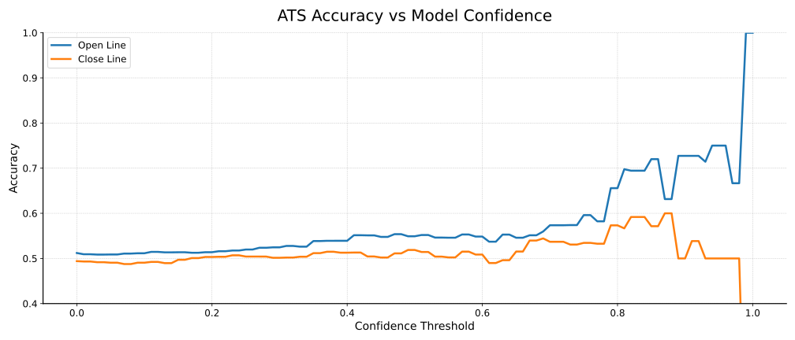

# NFL Prediction Model

## Disclaimer

This project is purely for personal interest. I do not encourage sports betting, and if you are using this website to sports bet you should probably go home and rethink your life...

## Overview

An extension of the [Glickman-Stern model](https://www.glicko.net/research/nfl.pdf) for NFL predictions, adding quarterback effects to estimate team and QB strength.

- [Visit the website](https://iggysiegel.github.io/NFL/) - See the model's weekly predictions.
- [View the results](docs/Evaluation.ipynb) - Explore historical performance and future work.


*Overall model performance on historical NFL games (2015 - 2025)

## Installation

To view this week's predictions, check out the website linked above.

If you want to fit the full state-space model yourself, create the conda environment provided. This project uses conda because PyMC and some of its dependencies install more reliably via conda channels.

```bash
conda env create -f environment.yml
```

## Usage

Fit the full state-space model from scratch (~15 min runtime depending on hardware):

```bash
python -m scripts.predict
```

Generate recommendations for the current week using the fitted model:

```bash
python -m scripts.update
```
