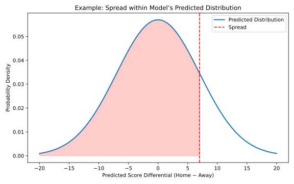
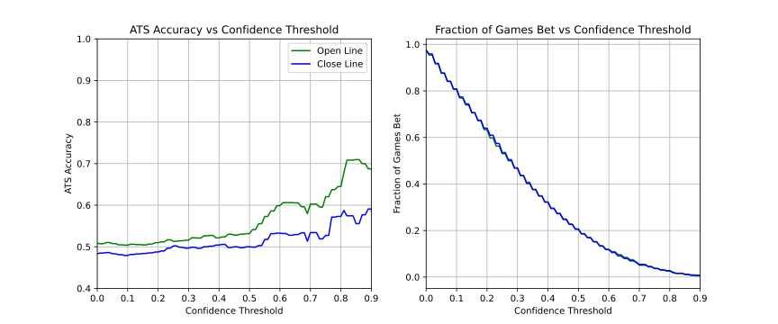

[Home](index.html) | [Weekly Predictions](upcoming.html) | [GitHub](https://github.com/iggysiegel/NFL)

---

## About This Site

Every Tuesday morning, the model generates predictions for the upcoming week. Check out [this week's predictions](upcoming.html) to see the latest forecasts!

## Overview

This website is a personal project for predicting NFL game outcomes compared to betting spread odds. The underlying prediction model is based on the work of [Glickman-Stern](https://www.glicko.net/research/nfl.pdf), which develops a Bayesian state-space model that tracks team strengths as they evolve over time, accounting for both week-to-week changes due to injuries, and season-to-season changes due to roster turnover.

The biggest weaknesses of the original formulation is its inability to capture individual quarterback effects. When Patrick Mahomes is injured, the model does not immediately recognize this, or know how much to penalize the Kansas City Chiefs. In my extension of the model, I add explicit quarterback effects, with initial adjustments based on career experience (rookies vs. established veterans).

Unlike simpler rating systems such as ELO, the fully Bayesian approach offers several advantages. Instead of a single point estimate for the outcome of a game, the state-space approach creates a full probability distribution of outcomes, where the predictions account for uncertainty in all model parameters.

## Model Confidence

For each game, the model creates a full probability distribution of outcomes, and we can identify where the betting spread falls within the model's probability distribution. The following figure illustrates this concept. The blue curve represents the model's predicted distribution of score differentials, and the dashed red line shows where the actual betting spread lies within that distribution:

In this example, the spread lies far to the right of the model's expected distribution. This indicates that the market may be overestimating the home team's advantage, and the model would favor a bet on the away team. To express this idea in a more concrete way, we define a metric called **confidence** with values ranging from zero to one representing the magnitude of difference between the model's prediction and the betting spread.

## Results

To test whether the model translates into actual value against the spread, we test a simple betting strategy:

- Define a minimum confidence threshold (e.g. 0.5). Only games where the model's confidence exceeds this threshold are considered for betting.
- For each qualifying game, bet on whichever team the model favors (the side where the model's prediction is more extreme than the betting spread).
- Compute against the spread accuracy using actual game results.

If the model is able to capture the true underlying strengths of teams, we would expect to see high performance when the model's predictions differ significantly from the betting spread odds. The following figure demonstrates the results of this betting simulation using data from 2015 to 2025.

The lefthand figure shows the against the spread (ATS) accuracy at increasing confidence thresholds--the green line is ATS versus the opening spread, the blue line is ATS versus the closing spread. This figure shows the model does a much better job predicting against the opening line than it does against the closing line. The righthand figure shows the proportion of games that are bet on at increasing confidence thresholds. As expected, at very high confidence thresholds there are very few games eligible for betting. 

While the overall trend shows higher confidence thresholds correspond to higher ATS accuracy, individual seasons can still experience losses. This occurs because high-confidence bets become increasingly rare. At a 50% confidence threshold, there are typically fewer than 50 bets per season. With such small sample sizes, variance alone can produce losing seasons roughly 25% of the time, even with a genuine edge. This highlights an important tradeoff: higher confidence thresholds improve accuracy but reduce bet volume, making season-by-season performance more volatile.

To identify an optimal confidence threshold, we evaluated each threshold using bootstrapped confidence intervals for total profit and ROI. The results suggest that a confidence threshold around 0.6 performs best against the opening line. Against the closing line, no threshold shows positive expected value at the 95% confidence level once accounting for the vig.

## Future Work

The model seems to perform well in the aggregate, but it has important blind spots. The model cannot account for mid-week developments or motivational factors such as a team already eliminated from the playoffs, and it takes time to learn new quarterback effects. When unusual circumstances arise, it's best to either skip the game entirely or adjust your confidence threshold accordingly. Simple statisical models work best under "normal" conditions where historical patterns remain relevant.

Several areas could improve the model. First, home-field advantage could be made context-dependent, varying with factors like rest disparities, divisional familiarity, and game importance. Second, quarterback effects could evolve dynamically over time rather than remaining static across three-year periods. Finally, modeling efficiency metrics like EPA or WPA instead of raw point differentials might better capture underlying team and quarterback performance.

As a disclaimer, this project is purely for personal interest. I do not encourage sports betting, and if you are using the website to sports bet proceed carefully...
